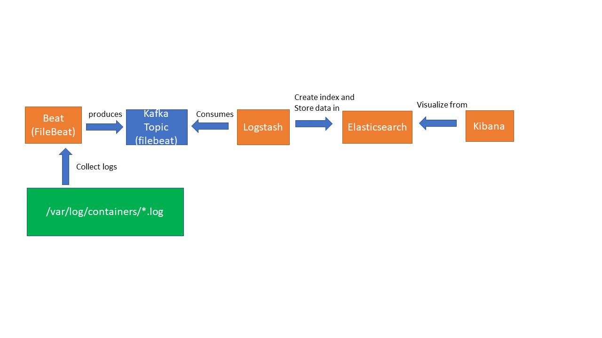
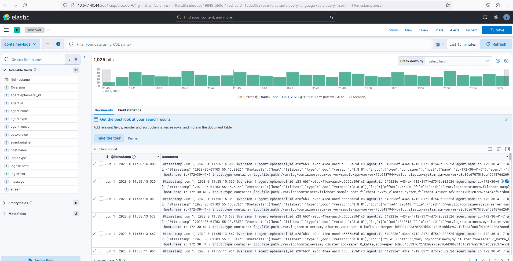
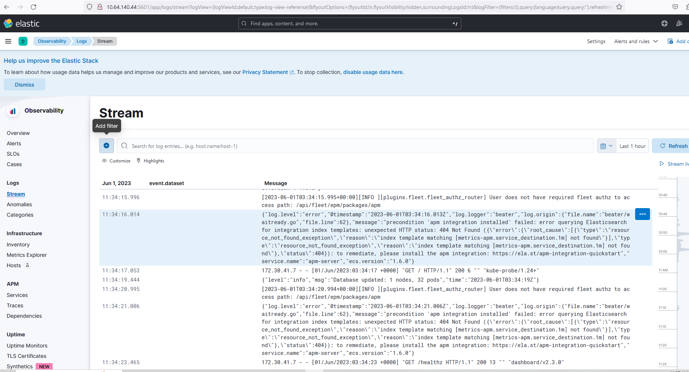

# Elastic Stack

The Elastic Stack, also known as the ELK Stack, is a powerful collection of open-source software tools developed by Elastic. Each component of the stack serves a specific purpose and can be used together to gather, analyze, and visualize data. Here are the main functionalities of the Elastic Stack components:

Elasticsearch: Elasticsearch is a distributed, highly scalable, and real-time search and analytics engine. It stores and indexes data in near real-time, enabling fast and efficient searching, querying, and filtering of large datasets. Elasticsearch is designed for horizontal scalability and can handle high volumes of data and complex search queries.

Logstash: Logstash is a flexible data ingestion and transformation pipeline. It enables you to collect, process, and enrich data from various sources, such as log files, metrics, and databases. Logstash supports a wide range of input plugins for data ingestion, filter plugins for data transformation and enrichment, and output plugins for sending data to various destinations, including Elasticsearch.

Kibana: Kibana is a powerful data visualization and exploration tool. It provides a web interface that allows you to create interactive dashboards, charts, and graphs to visualize and analyze data stored in Elasticsearch. Kibana offers a variety of data exploration and discovery features, including ad hoc querying, filtering, and drilling down into specific data subsets.

Beats: Beats are lightweight data shippers that can be used to send different types of data to Elasticsearch or Logstash. There are several specialized Beats available for specific use cases, such as:

Filebeat: Ingests and sends log files and other text-based data to Elasticsearch or Logstash.
Metricbeat: Collects system-level and application-level metrics from servers and services.
Packetbeat: Monitors network traffic and captures network-level data for analysis.
Auditbeat: Captures security-related events from the operating system and services.

APM (Application Performance Monitoring): The Elastic Stack also includes APM agents that enable application-level monitoring. These agents collect performance metrics, traces, and errors from applications and send them to Elasticsearch for analysis and visualization. The APM functionality allows you to monitor the performance and health of your applications and troubleshoot issues.

Machine Learning (ML): The Elastic Stack provides machine learning capabilities through its ML features. ML in the Elastic Stack can automatically detect anomalies, forecast trends, and classify data based on patterns and behaviors. It helps identify unusual behaviors or anomalies in your data, such as security threats, system failures, or performance degradation.

## FileBeat + Kafka + Logstash + Elasticsearch + Kibana

Here is one of Beat example on how to use Kafka as a message broker between FileBeat and Logstash. FileBeat will send data to Kafka and Logstash will consume data from Kafka. Logstash will then create a index nd send data to Elasticsearch and Kibana will visualize data from Elasticsearch.

Using Apache Kafka as a middleware between Filebeat and Logstash can provide several benefits in a distributed log processing architecture. Here are some advantages:

Scalability: Kafka acts as a highly scalable and distributed messaging system. It can handle high message throughput and store large volumes of data for efficient processing. By introducing Kafka, you can scale your log processing pipeline by adding more Logstash instances without overwhelming Filebeat or the downstream systems.

Buffering and Reliability: Kafka acts as a buffer between Filebeat and Logstash, decoupling their processing rates. If Logstash experiences a temporary spike in load or becomes unavailable, Kafka can temporarily store the log events until Logstash is ready to consume them. This buffering capability helps ensure reliable log ingestion and prevents data loss.

Data Integration: Kafka supports pub/sub messaging, allowing multiple consumers (including Logstash) to subscribe to the same log stream. This enables integration with other data processing systems, such as real-time analytics engines or data warehousing solutions. You can easily connect additional applications or services to consume the log data from Kafka, providing flexibility in your data pipeline.

Fault-tolerance: Kafka's distributed nature ensures fault tolerance and high availability. It replicates log events across multiple brokers in a cluster, providing data redundancy. If one broker fails, the log data is still accessible from other brokers, ensuring that log processing can continue without interruption.

Logstash Offloading: Kafka can offload the processing load from Logstash by acting as a temporary storage solution. Instead of Logstash directly receiving log events from Filebeat, it consumes them from Kafka, allowing Logstash instances to operate at their optimal speed and handle complex transformations or enrichments without impacting the ingestion phase.

Backpressure Handling: If Logstash becomes overwhelmed or experiences a slowdown, Kafka can handle backpressure efficiently. It can slow down the rate of log event consumption based on the consumer's processing speed. This helps prevent resource exhaustion and ensures that log processing remains stable.

Flexible Architecture: By introducing Kafka, you create a more modular and flexible architecture. You can easily replace or upgrade individual components (e.g., upgrade Logstash or replace Filebeat with another log shipper) without disrupting the entire pipeline. Kafka acts as a central hub that facilitates communication and data flow between different components.

View in Kibana - Discover

View in Kibana - Observability

