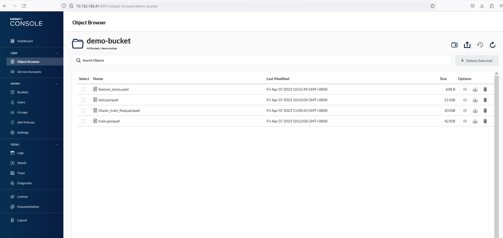

# Minio

Minio is an open-source object storage system that is designed to be simple, lightweight, and scalable. It is compatible with the Amazon S3 API, making it easy to use with existing S3-compatible tools and applications.

Minio is built on a modular architecture that allows users to easily scale the storage system horizontally and vertically, adding more nodes and disks as needed. It supports various storage backends, including local disks, cloud storage services, and distributed file systems, providing users with a flexible and versatile storage solution.

One of the key features of Minio is its high performance and low latency, which is achieved through its use of erasure coding and bitrot protection techniques. This ensures that data is always available and protected against data corruption.

Minio also provides a web-based graphical user interface (GUI) and a command-line interface (CLI), enabling users to manage and monitor their storage system with ease. It also supports a wide range of programming languages and SDKs, making it easy to integrate with existing applications and workflows.

Minio as Object stores is used for MLOps project to store artifacts such as training dataset and AI Models.